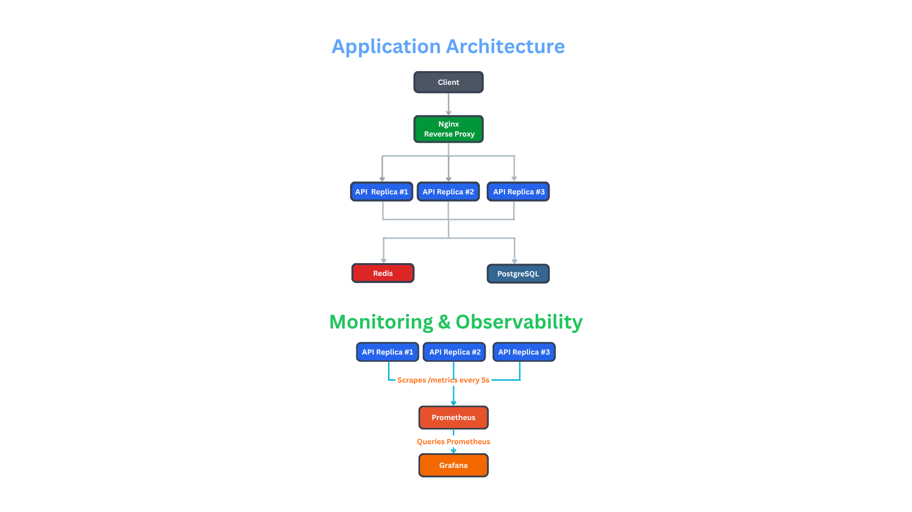

# 🚀 Infra Lab

A production-like containerized platform built to learn backend infrastructure, scalability, caching, and observability.

## ✨ Features

* 🐳 Docker Compose based multi-container architecture
* 🌐 Nginx Reverse Proxy
* ⚡ Horizontally Scaled Node.js APIs
* 🐘 PostgreSQL persistence with Docker volumes
* 🔥 Redis caching layer
* ❤️ Health Check endpoint
* 📊 Prometheus metrics collection
* 📈 Grafana dashboards for observability
* 🔄 Round-robin load balancing and service discovery

---

## 🏗️ Architecture

---

## Endpoints

### Health Check

GET /api/health

### Users

GET /api/users

### Metrics

GET /api/metrics

---

## Monitoring Metrics

* Requests per second (RPS)
* CPU Usage
* Memory Usage
* Event Loop Lag
* Database Connectivity Status

---

## Tech Stack

* Node.js
* Docker & Docker Compose
* Nginx
* PostgreSQL
* Redis
* Prometheus
* Grafana
* Linux

---

## Learning Outcomes

* Container Networking
* Service Discovery
* Reverse Proxy Configuration
* Horizontal Scaling
* Caching Strategies
* Database Persistence
* Observability & Monitoring
* Production Debugging

---

## Demo

See screenshots and demo GIF below.

## 📸 Screenshots

### Grafana Dashboard

### Prometheus Targets

### Load Balancing Demo

### Redis Cache Demo
 

* Database → Redis → Cache Hit workflow

Built for learning real-world backend infrastructure and DevOps concepts.

## Demo Video Clip

<video width="100%" controls>
  <source src="arch.mp4" type="video/mp4">
  Your browser does not support the video tag.
</video>
