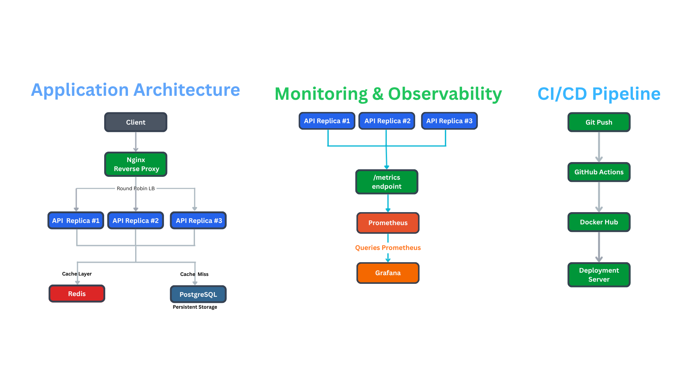
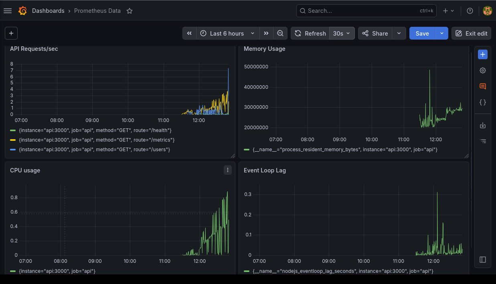
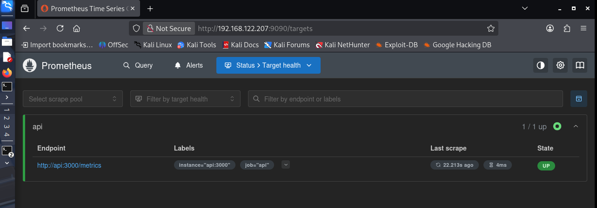
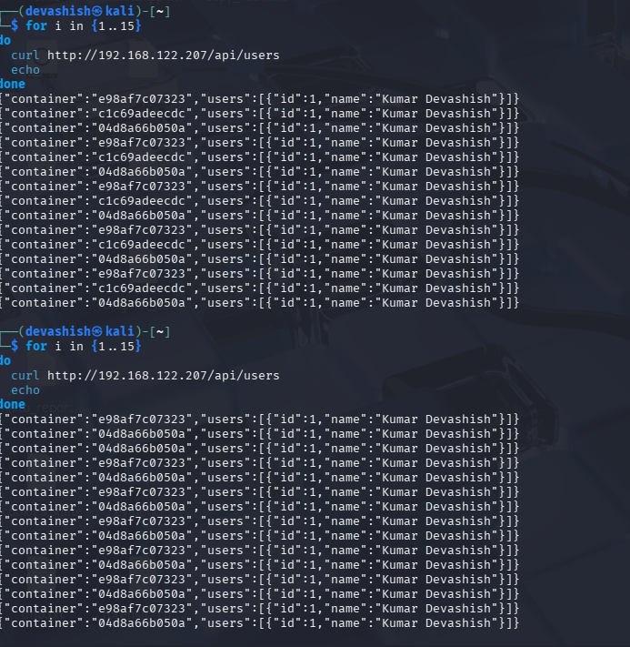
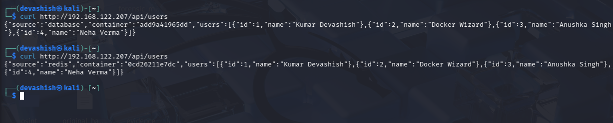

# 🚀 Infra Lab


A production-like containerized platform built to learn backend infrastructure, scalability, caching, and observability.

## ✨ Features

* 🐳 Docker Compose based multi-container architecture
* 🌐 Nginx Reverse Proxy
* ⚡ Horizontally Scaled Node.js APIs
* 🐘 PostgreSQL persistence with Docker volumes
* 🔥 Redis caching layer
* ❤️ Health Check endpoint
* 📊 Prometheus metrics collection
* 📈 Grafana dashboards for observability
* 🔄 Round-robin load balancing and service discovery
* ⚙️ GitHub Actions based CI pipeline
* 📦 Automated Docker image publishing to Docker Hub
* 🏷️ Versioned Docker images using Git commit SHA tags
* 🔁 Rollback support using immutable image tags

---

## 🏗️ Architecture



The application uses Nginx as a reverse proxy and load balancer to distribute requests across multiple Node.js API replicas. Redis acts as a caching layer to reduce database load, while PostgreSQL provides persistent storage. Prometheus scrapes metrics from the API replicas and Grafana visualizes operational metrics such as request rate, CPU usage, memory usage, and event loop lag. Docker images are automatically built and published to Docker Hub using GitHub Actions, enabling deployment on any Docker-enabled Linux machine.

---

## Endpoints

## 🌐 API Endpoints

```http
GET /api/health
GET /api/users
GET /api/metrics
```

---

## Monitoring Metrics

* Requests per second (RPS)
* CPU Usage
* Memory Usage
* Event Loop Lag
* Database Connectivity Status

---

## Tech Stack

* Node.js
* Docker & Docker Compose
* Nginx
* PostgreSQL
* Redis
* Prometheus
* Grafana
* Linux

---

## Learning Outcomes

* Container Networking
* Service Discovery
* Reverse Proxy Configuration
* Horizontal Scaling
* Caching Strategies
* Database Persistence
* Observability & Monitoring
* Production Debugging
* CI Automation using GitHub Actions
* Artifact Publishing using Docker Hub
* Immutable Image Versioning
* Cross-machine Container Deployment
* Rollback Strategies

---
## 🚀 Getting Started

git clone https://github.com/kumar10248/infra-lab.git
cd infra-lab
docker compose up -d

Access:
```http
- API: http://localhost/api
- Admin: http://localhost/admin
- Prometheus: http://localhost:9090
- Grafana: http://localhost:3001
```
## 🚀 Deployment

Docker images are automatically built and published to Docker Hub using GitHub Actions.

Pull images:
```http
docker pull kumar10248/infra-lab-api:latest
docker pull kumar10248/infra-lab-admin:latest
```
Specific version deployment:
```http
docker pull kumar10248/infra-lab-api:<git-sha>
docker pull kumar10248/infra-lab-admin:<git-sha>
```
## Demo

See screenshots and demo GIF below.

## 📸 Screenshots

### Grafana Dashboard


### Prometheus Targets



### Load Balancing Demo



### Redis Cache Demo
 

* Database → Redis → Cache Hit workflow

## CI/CD Pipeline

Developer
    ↓
git push
    ↓
GitHub Actions
    ↓
Validate Docker Compose
    ↓
Build Docker Images
    ↓
Tag Images (latest + commit SHA)
    ↓
Push Images to Docker Hub
    ↓
Pull and Deploy on Any Docker-enabled Machine

Built for learning real-world backend infrastructure and DevOps concepts.

## Demo Video Clip

🎥 Demo Video: [Watch Here](./arch.mp4)

